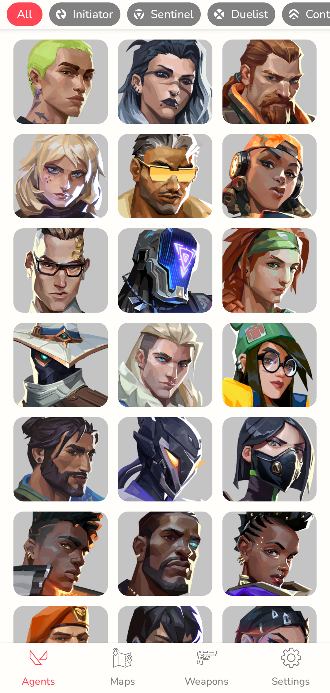
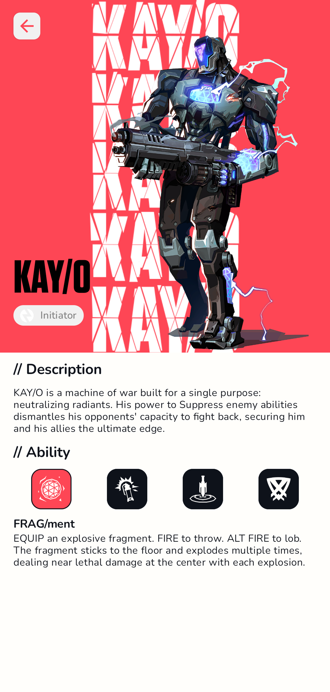
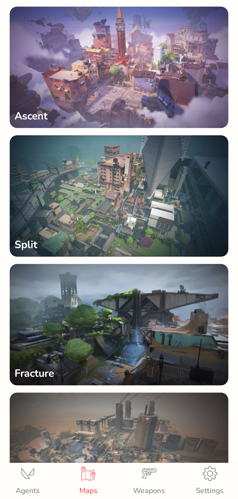
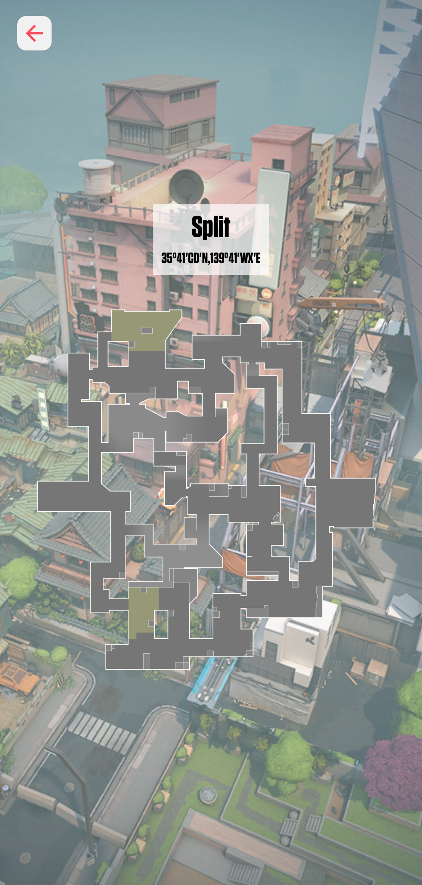
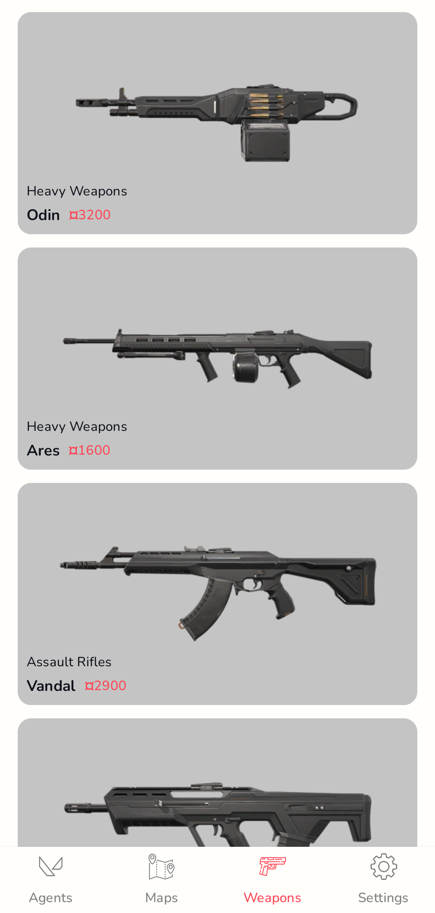
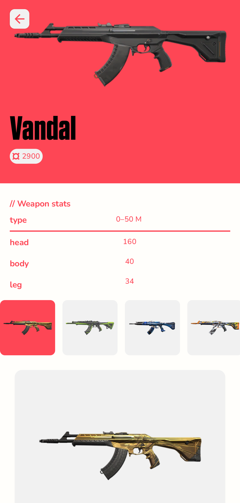

# Valorant Info

Valorant Info is a mobile app that offers users access to comprehensive Valorant game information with features such as agent profiles, map guides, weapon databases, and skin collections.

## 📱 Features

- Browse All Valorant Agents with Abilities and Stats
- Explore Complete Map Database with Tactical Layouts
- Comprehensive Weapon Arsenal with Detailed Statistics
- Discover Weapon Skins and Collections
- Dark and Light Theme Support

## Requirements

- **Minimum Android Version**: 8.0 (Oreo)

## 📸 Screenshots

<table>
  <tr>
    <td></td>
    <td></td>
  <tr>
  <tr>
    <td></td>
    <td></td>
  </tr>
  <tr>
    <td></td>
    <td></td>
  </tr>
</table>

## 🛠️ Contents & Libraries

- MVI
- Clean Architecture, Multi-Module
- Jetpack Compose
- Material3
- Jetpack Navigation
- Dagger, Hilt
- Kotlin
- Kotlinx Serialization
- Ktor Client
- Coroutines
- DataStore
- Room
- Paging
- Shimmer
- Lint
- Coil

## 📫 Contact

For any questions or suggestions, feel free to reach out via email at **denis.akhunov123@gmail.com**
